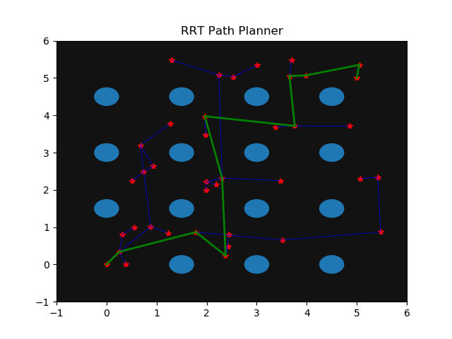
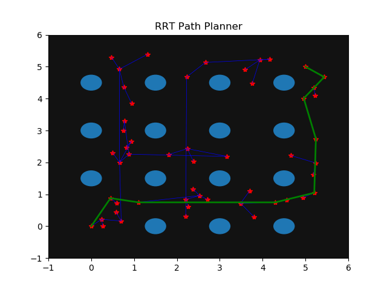
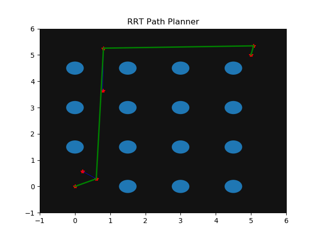
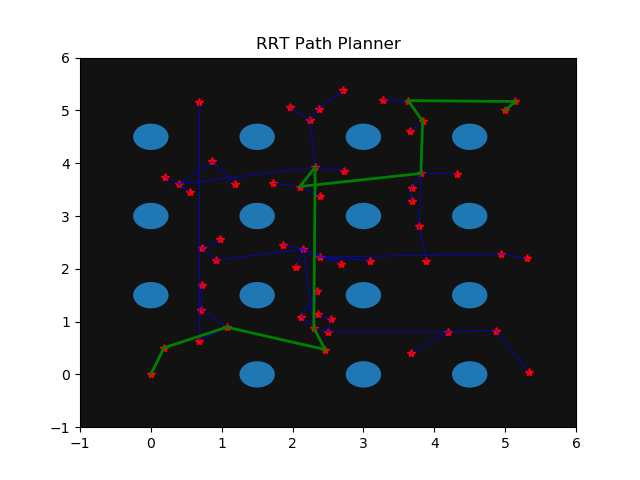
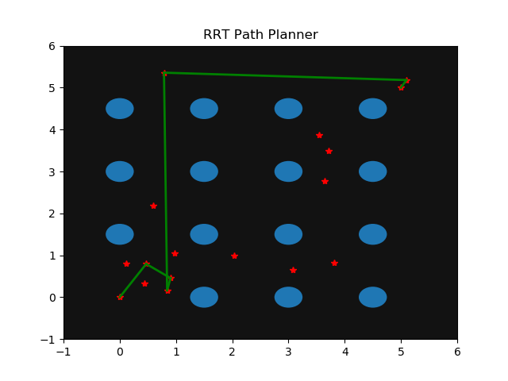
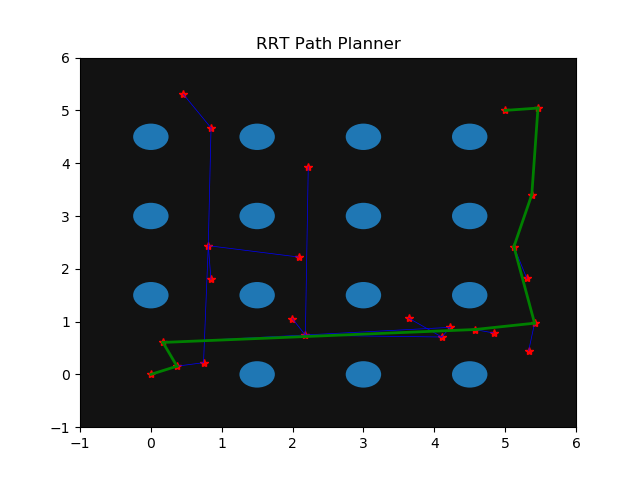
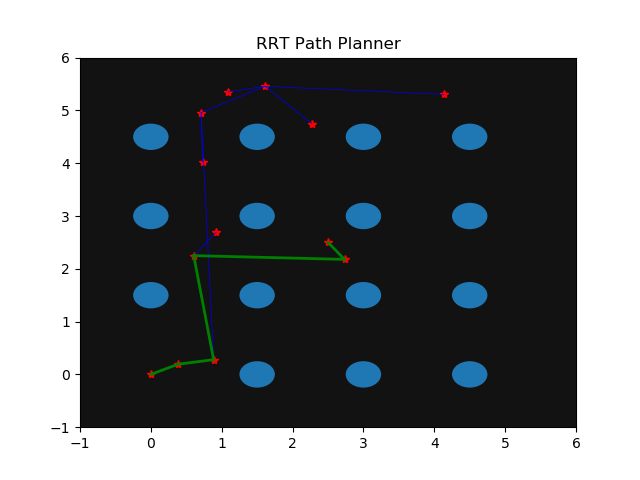
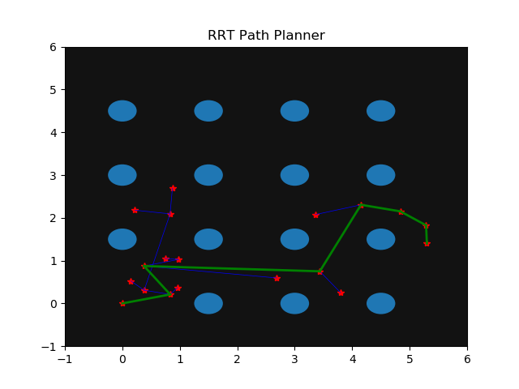

# Path Planning

## _RRT Implementation:_
In a tree structure, every node has only one parent 
- ### Logic

    - Randomly sample a point in the given space and if it lies inside an obstacle, sample a point again till a point that is at a distance of clearanceRadius is obtained. 
    <code>
    clearanceRadius = botRadius(approximate radius of the circle circumscribing the bot) + obstacleRadius
    </code>
     
    This ensures that if the bot is positioned on that point, it would not be in contact with an obstacle.

    - Connect this point to the nearest available 'Node' under the condition that the line joining the nodes is clear of any obstacle.
    - Continue this process until a node from which a direct path to the goal point is feasible is found
    - Once the goal node is found, trace back the path by tracking the parent of the goal node, and the parent of that node, and so on till the initial node (0, 0) is reached
    - Store the points in a list and publish it on a rostopic ('path')
  
- ### Some improvements to be made in the future:
    - The path generated is not always efficient. Many times a shorter and direct path is available. (Solution, RRT*)
    - The algorithm is modified from fundamental RRT so that when a new node is sampled, it directly connects it to the nearest node if the path is feasible(does not cross an obstacle).  In case of RRT, the new node is generated at a distance which is the minimum of the direct distance between the two points or a pre defined 'step size' in the direction of the new sampled point.   This leads to most of the sampled points being used (rather than discarded because the path to it leads through an obstacle) and more area of the field is explored.
    - The step of connecting a sampled point directly to the goal point if feasible may accomplish the task in less time. But as a consequence, it leaves a large part of the map unexplored.

 

___
 

### Paths planned - some examples:
 

> Goal Coordinate (5.0, 5.0)

  

> Goal Coordinate (2.5, 2.5) 

  

> Goal Coordinate (5.3, 1.3)  

